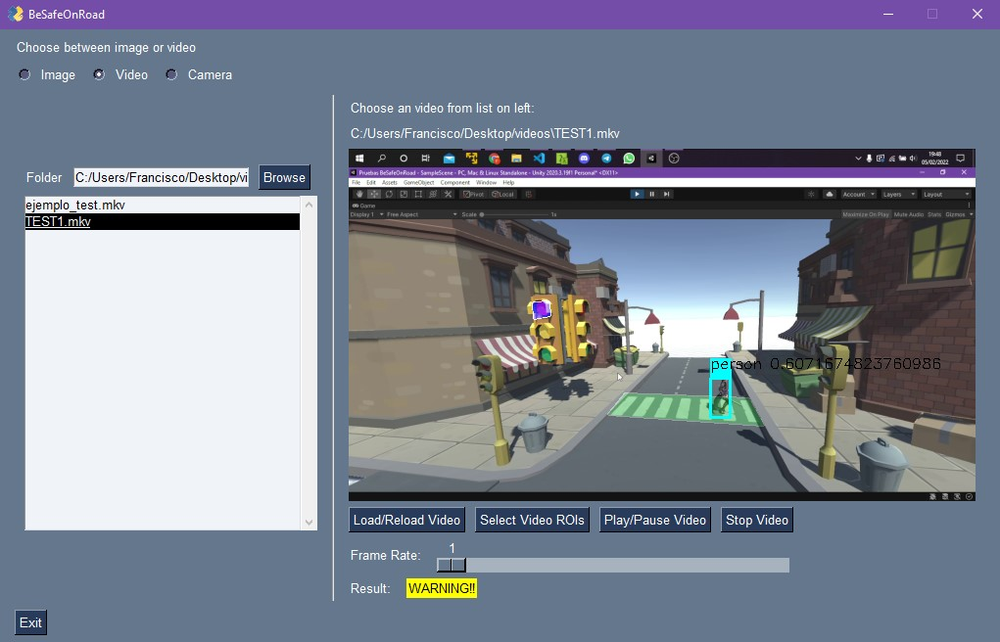

# **BeSafeOnRoad**

- University of La Laguna, Computer Science
- **Subject:** Intelligent Systems

<br>

## **Index** <!-- omit in toc -->

- [**BeSafeOnRoad**](#besafeonroad)
  - [**Authors**](#authors)
  - [**Description**](#description)
  - [**Requirements**](#requirements)
  - [**Installation**](#installation)
  - [**Program Usage**](#program-usage)
    - [**Processing Image**](#processing-image)
    - [**Processing Video**](#processing-video)
    - [**Processing Camera**](#processing-camera)

<br>

## **Authors**

- Sergio de la Barrera García (alu0100953275@ull.edu.es)
- Francisco Jesús Mendes Gómez (alu0101163970@ull.edu.es)
- Sergio Tabares Hernández (alu0101124896@ull.edu.es)

<br>

## **Description**

This program implements an Artificial Intelligence system capable of detecting pedestrians crossing the road when its traffic light is on red by using the YOLOv5 model, a convolutional neural network for object detection on images.

<br>

## **Requirements**

``` bash
- python3
- opencv-python
- imutils
- numpy
- pillow
- pysimplegui
- shapely
```

<br>

## **Installation**

First of all, you have to clone our repository:

`$ git clone https://github.com/CorEHarD5/BeSafeOnRoad.git` 

Then you must install all the dependencies, it can be simply done by using:

`$ pip install -r requirements.txt` 

<br>

## **Program Usage**

To execute this program you can run the following snippet:

```
  $ cd BeSafeOnRoad/
  $ python3 ./main.py
```

Then it will show you the main window where you can select between several options: image file, video file or camera input

<br>

### **Processing Image**

1. Select the folder where you have the image you want to process, it will show you a list of all image files in that folder.  


2. In the showing list, choose the target image and then push the 'Start Checking'  button.


3. Then you have to select the regions of interest by pushing the 'Select ROIs' button:  

Instructions to select a ROI:  


   - In the first pop up window you have to select the crosswalk ROI on the image. Once you have selected the area, press 'S' key to save it.


   - Then it will pop up a second window where you have to do the same as before, but this time selecting the predestrian traffic light.


4. It will show you the processed image and a result text.
   


At this stage, you can load another image or check the same one again. While executing the program you can end it by pressing the 'Exit' button or by closing the main window. 

<br>

### **Processing Video**

1. Select the folder where you have the video you want to process, it will show you a list of all video files in that folder.  


2. In the showing list, choose the target video and then push the 'Load/Reload Video'  button.  


3. Then you have to select the regions of interest by pushing the 'Select Video ROIs' button:  


Instructions to select a ROI:  


   - In the first pop up window you have to select the crosswalk ROI on the frame. Once you have selected the area, press 'S' key to save it.


   - Then it will pop up a second window where you have to do the same as before, but this time selecting the predestrian traffic light.


4. After doing the selection, press the 'Play/Pause Video' button in order to start the video processing.  




5. Finally you can choose the frame rate you want by using the slider, pause the video execution or stop it completely.

At this stage, you have several options you can choose:
 - Load another video
 - Reload the current video
 - Select others ROIs

While executing the program you can end it by pressing the 'Exit' button or by closing the main window. 

<br>

### **Processing Camera**

1. In the showing list, choose the target camera and then push the 'Load/Reload Camera'  button.  


2. Then you have to select the regions of interest by pushing the 'Select Camera ROIs' button:  


Instructions to select a ROI:  

   - In the first pop up window you have to select the crosswalk ROI on the frame. Once you have selected the area, press 'S' key to save it.


   - Then it will pop up a second window where you have to do the same as before, but this time selecting the predestrian traffic light.


3. After doing the selection, press the 'Play/Pause Camera' button in order to start the camera processing.


4. Finally you can choose the frame rate you want by using the slider, pause the camera execution or stop it completely.

At this stage, you have several options you can choose:
 - Load another video
 - Reload the current video
 - Select others ROIs

While executing the program you can end it by pressing the 'Exit' button or by closing the main window. 

